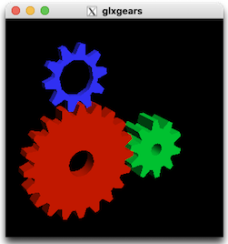

# Running `glxgears` on macOS

`glxgears` is an ancient OpenGL "hello world" -program that can be used to see that the Linux containerized environment can use the host's OpenGL.

Windows 10 WSLg should do this automatically. MacOS needs some setup.

## Requirements

- XQuartz installed

   To see that it is:
   
   ```
   $ echo $DISPLAY
   /private/tmp/com.apple.launchd.1lXtMDCQHO/org.xquartz:0
   ```

   ```
   $ glxgears
   ...
   ```
   
   

   That should be fine!

   This is the ´glxgears` program running on your Mac side. Now, let's get Docker involved.

- Docker Desktop for Mac
- `socat`

   ```
   $ brew install socat
   ```

<!-- Developed on:

- macOS 11.5 / Intel
- Docker Desktop for Mac 3.6.0
-->


## Steps

**1. Enable indirect rendering (one time)**

```
$ defaults write org.macosforge.xquartz.X11 enable_iglx -bool true
```

**2. Launch XQuartz**

From the icon, or otherwise.

```
$ xhost +
access control disabled, clients can connect from any host
```

**3. Run `socat`**

This is needed, for things to work. 

Connects the port `6000` to a file that's (presumably) representing the display driver:

```
$ socat TCP-LISTEN:6000,reuseaddr,fork UNIX-CLIENT:\"$DISPLAY\"
...
```

Leave it running.

**4. Launch Docker**

```
$ docker compose run --rm glxgears
...
```

<!--
>From [XQuartz #144 comment](https://github.com/XQuartz/XQuartz/issues/144#issuecomment-847503366)

```
docker run --rm -it -v /tmp/.X11-unix:/tmp/.X11-unix -e DISPLAY=host.docker.internal:0 tbillah/glxgears-docker:latest glxgears
5217 frames in 90.8 seconds = 57.426 FPS
5531 frames in 27.4 seconds = 201.978 FPS
...
```
-->

The gears demo seems to travel **really slowly** but the FPS figures printed within Docker look good.

Go figure?!?


## Troubles

### `socat` "Address already in use"

Use this to see which process holds onto the port 6000 (and kill it):

```
$ lsof -n -i | grep 6000
```

[source](https://bitsanddragons.wordpress.com/2020/06/05/address-already-in-use-socat-not-working-on-osx/)


## References

- [Running an X Server with Indirect GLX Rendering on MacOS for containerized applications with GUIs](https://blog.mkari.de/posts/glx-on-mac/) (blog, Nov 2020) [1]

